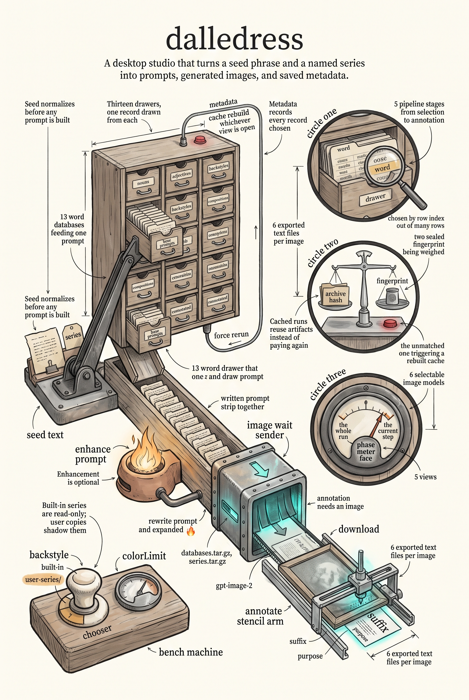

# Dalledress

A TrueBlocks Wails GUI app generated by `newapp`. It follows the shared
architecture documented in `trueblocks-art/ai/Architecture.md`: appkit
bootstrap, NavState persistence, and the standard keyboard navigation
(Cmd+N to switch views, repeated Cmd+N to cycle a view's tabs, Cmd+R to
refresh the active view, all positions persisted and restored on launch).
Prompts, images, series, and the word databases come from
`trueblocks-dalle`, which embeds its databases and series as archives and
caches them under the dalle data directory.

## Views

- Dashboard — set the seed, series, model, and background, then preview
  the prompt or generate (optionally enhancing, imaging, and annotating)
- Images — gallery and detail view of generated images, with open, reveal
  in Finder, export text, regenerate, and delete
- Series — browse and edit series definitions; built-in series are read-only
- Databases — browse the embedded databases and their records
- Settings — runtime info, image model, and generation defaults

## Commands

- `make build` — build the bundled .app into `build/bin/`
- `make dev` — hot-reload development inside the Wails webview
- `make lint` / `make type-check` / `make test`

## Layout

- `main.go` — thin `appkit.Run` bootstrap
- `app/` — Wails-bound App struct (embeds `appkit.NavState`, wraps the
  `dalle.Engine`)
- `design/` — design notes, e.g. the series source-of-truth design
- `frontend/` — React + Mantine UI using `@trueblocks/ui` (AppLayout,
  useViewHotkeys, usePersistedTab)

