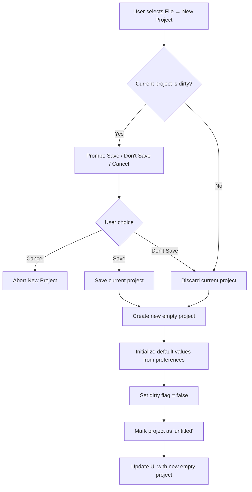

# File New Flow Diagram

```mermaid
flowchart TD
    A[User selects File → New Project] --> B{Current project is dirty?}

    B -- Yes --> C[Prompt: Save / Don't Save / Cancel]
    C --> D{User choice}
    D -- Cancel --> E[Abort New Project]
    D -- Save --> F[Save current project]
    D -- Don't Save --> G[Discard current project]

    B -- No --> G[Discard current project]
    F --> H[Create new empty project]
    G --> H

    H --> I[Initialize default values from preferences]
    I --> J[Set dirty flag = false]
    J --> K[Mark project as 'untitled']
    K --> L[Update UI with new empty project]
```
