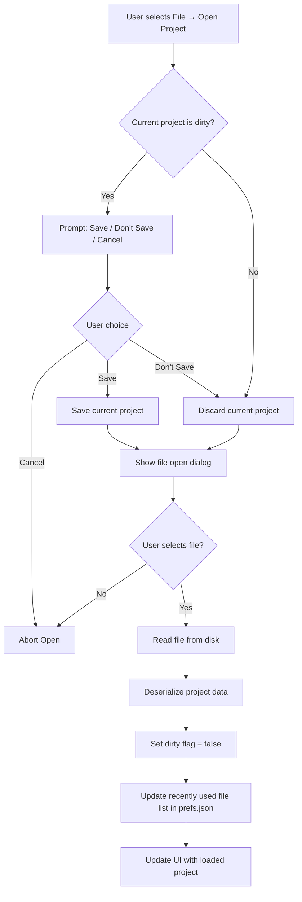

# File Open Flow Diagram

```mermaid
flowchart TD
    A[User selects File → Open Project] --> B{Current project is dirty?}

    B -- Yes --> C[Prompt: Save / Don't Save / Cancel]
    C --> D{User choice}
    D -- Cancel --> E[Abort Open]
    D -- Save --> F[Save current project]
    D -- Don't Save --> G[Discard current project]

    B -- No --> G[Discard current project]
    F --> H[Show file open dialog]
    G --> H

    H --> I{User selects file?}
    I -- No --> E
    I -- Yes --> J[Read file from disk]
    J --> K[Deserialize project data]
    K --> L[Set dirty flag = false]
    L --> M[Update recently used file list in prefs.json]
    M --> N[Update UI with loaded project]
```
