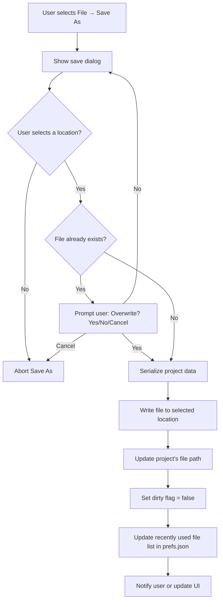

# File Save As Flow Diagram

```mermaid
flowchart TD
    A[User selects File → Save As] --> B[Show save dialog]
    B --> C{User selects a location?}
    C -- No --> D[Abort Save As]
    C -- Yes --> E{File already exists?}
    E -- Yes --> F[Prompt user: Overwrite? Yes/No/Cancel]
    F -- Cancel --> D
    F -- No --> B
    F -- Yes --> G[Serialize project data]
    E -- No --> G
    G --> H[Write file to selected location]
    H --> I[Update project's file path]
    I --> J[Set dirty flag = false]
    J --> K[Update recently used file list in prefs.json]
    K --> L[Notify user or update UI]
```
