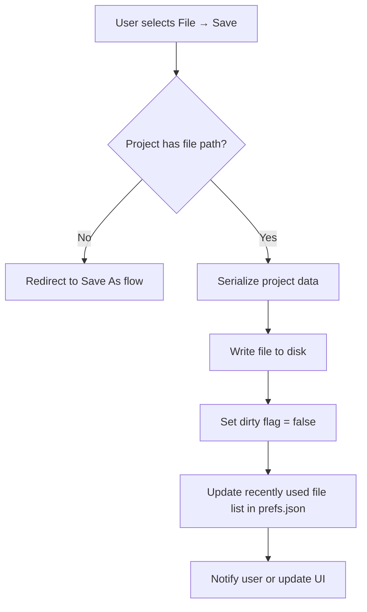

# File Save Flow Diagram

```mermaid
flowchart TD
    A[User selects File → Save] --> B{Project has file path?}

    B -- No --> C[Redirect to Save As flow]

    B -- Yes --> D[Serialize project data]
    D --> E[Write file to disk]
    E --> F[Set dirty flag = false]
    F --> G[Update recently used file list in prefs.json]
    G --> H[Notify user or update UI]
```
