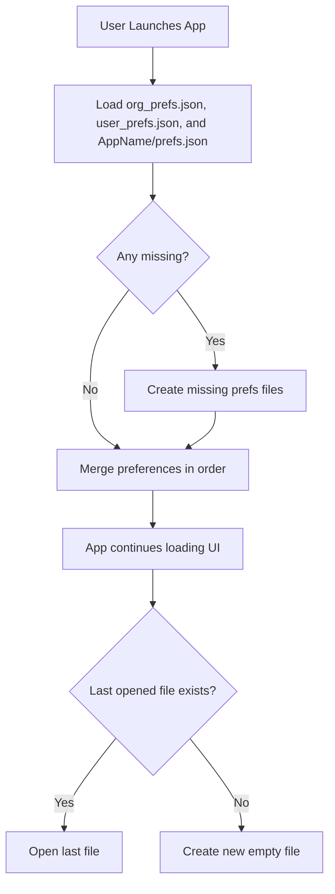

# Application Initialization

```mermaid
flowchart TD
    A[User Launches App] --> B[Load org_prefs.json, user_prefs.json, and AppName/prefs.json]

    B --> E{Any missing?}
    E -- Yes --> F[Create missing prefs files]
    E -- No --> H[Merge preferences in order]
    F --> H

    H --> I[App continues loading UI]
    I --> J{Last opened file exists?}
    J -- Yes --> K[Open last file]
    J -- No --> L[Create new empty file]
```
