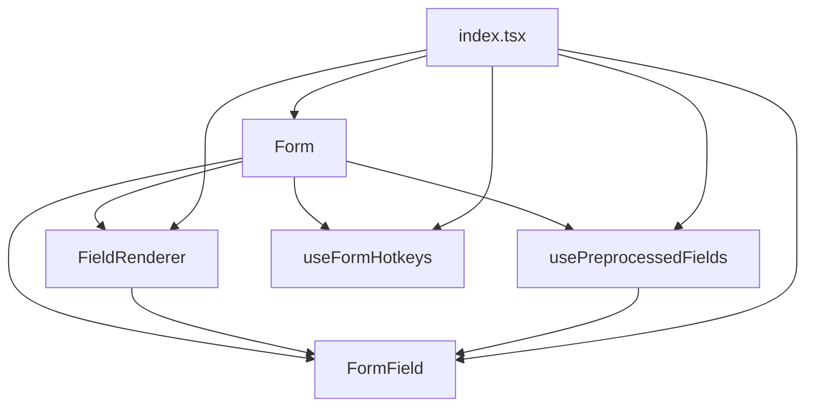
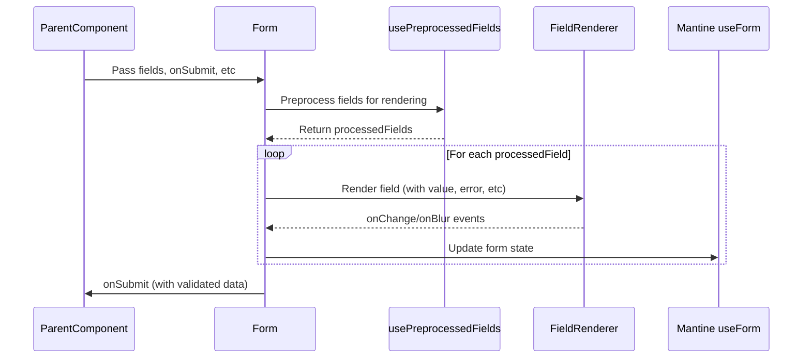
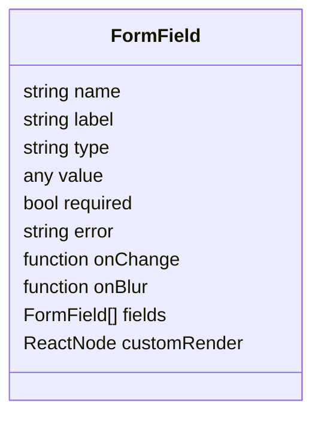
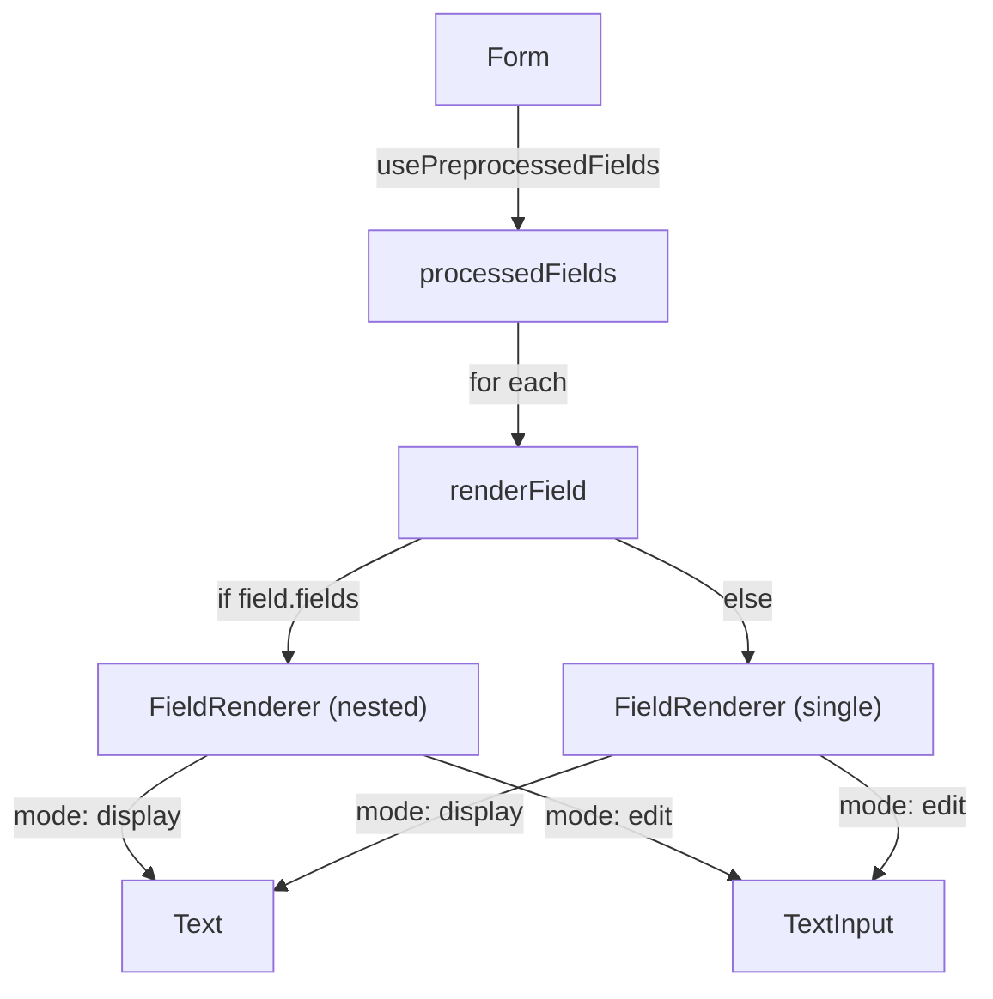
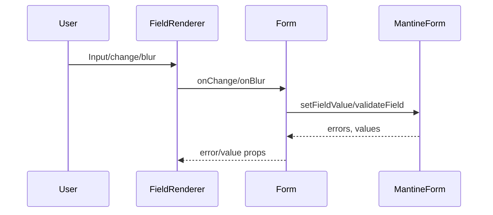
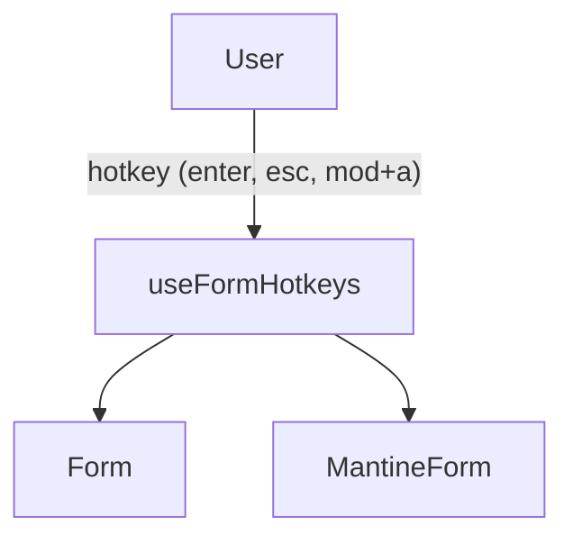

# Form Component Design (Mermaid Diagrams & Narrative)

This document explains the structure and flow of the form system in the codebase, focusing on how data, events, and rendering are managed. The goal is to help you understand not just the relationships, but the _lifecycle_ and _responsibilities_ of each part.

---

## 1. File/Component Relationship

This chart shows which files depend on or use which others. It helps you see the modularity and reusability of the form system.

---

## 2. Data & Event Lifecycle: How a Form Works

This chart and narrative walk you through what happens from the moment you provide a `fields` array to the moment a user submits the form.

**Narrative:**

- The parent component provides a `fields` array and handlers to `Form`.
- `Form` preprocesses these fields (flattening, grouping, filtering, etc) using `usePreprocessedFields`.
- For each processed field, `Form` renders a `FieldRenderer`, which knows how to display or edit that field.
- User input events (change, blur) flow from `FieldRenderer` back to `Form`, which updates the Mantine form state.
- On submit, `Form` validates and passes the data back to the parent.

---

## 3. FormField Structure (What is a Field?)

A `FormField` is a flexible description of a single input or a group of inputs. It can be deeply nested, allowing for complex forms.

---

## 4. Rendering Logic: How Nested Fields Work

This chart shows how the system supports both simple and nested (grouped) fields.

---

## 5. Event Flow: User Interaction

This chart focuses on how user actions propagate through the system.

---

## 6. Hotkey Handling (Keyboard UX)

The form system supports keyboard shortcuts for accessibility and speed.

---

## Summary

- **Form** is the orchestrator: it manages state, validation, and rendering.
- **FieldRenderer** is the visualizer: it knows how to display or edit a field, including nested groups.
- **usePreprocessedFields** is the organizer: it prepares the fields for rendering, handling grouping and visibility.
- **useFormHotkeys** is the UX enhancer: it adds keyboard shortcuts for a better user experience.
- **FormField** is the schema: it describes what each field is and how it should behave.

This system is designed for flexibility, composability, and a clear separation of concerns.
