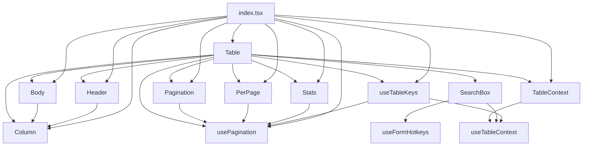
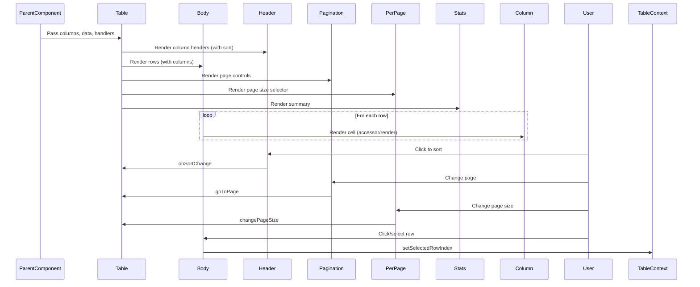
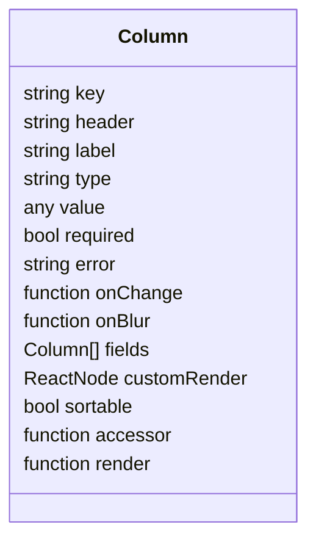
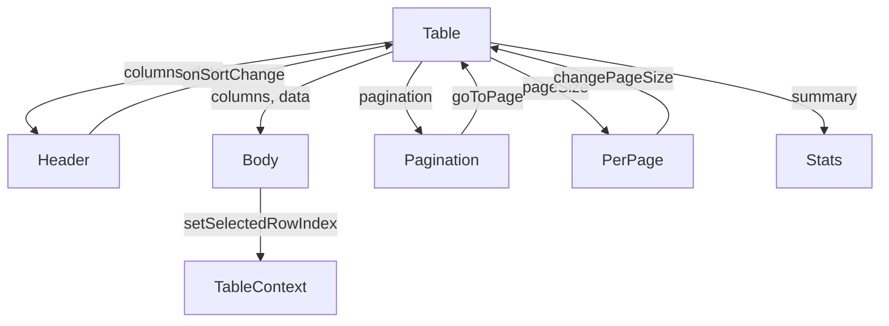
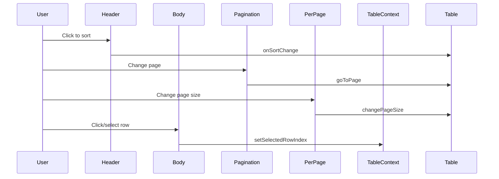
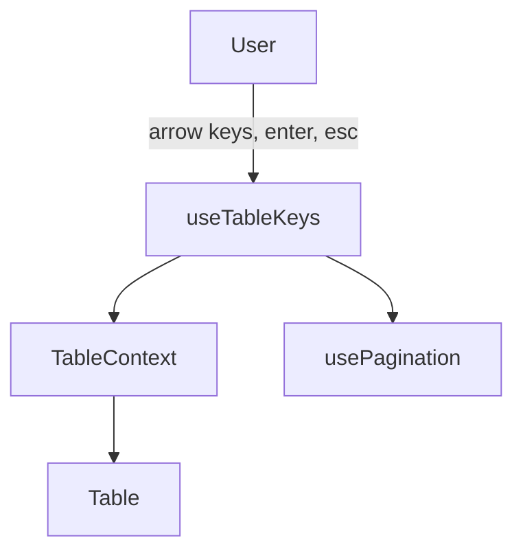

# Table Component Design (Mermaid Diagrams & Narrative)

This document explains the structure and flow of the table system in the codebase, focusing on how data, events, and rendering are managed. It is intended for contributors and maintainers who want to understand or extend the table components. (For form components, see the README in the form folder.)

---

## 1. File/Component Relationship

This chart shows which files depend on or use which others. It helps you see the modularity and reusability of the table system.

---

## 2. Data & Event Lifecycle: How a Table Works

This chart and narrative walk you through what happens from the moment you provide `columns` and `data` to the moment a user interacts with the table.

**Narrative:**

- The parent component provides `columns`, `data`, and handlers to `Table`.
- `Table` renders the header, body, pagination, per-page selector, and stats.
- Each row and cell is rendered using the `Column` definition (accessor/render).
- User actions (sort, paginate, select) flow through the appropriate subcomponents and update the table context or pagination state.

---

## 3. Column Structure (What is a Column?)

A `Column` is a flexible description of a single table column, including how to render and access its data.

---

## 4. Rendering Logic: Table Composition

This chart shows how the system supports both simple and complex tables, with sorting, pagination, and selection.

---

## 5. Event Flow: User Interaction

This chart focuses on how user actions propagate through the system.

---

## 6. Keyboard Navigation & Focus

The table system supports keyboard navigation and focus management for accessibility and speed.

---

## Summary

- **Table** is the orchestrator: it manages state, rendering, and delegates to subcomponents.
- **Header, Body, Pagination, PerPage, Stats** are the visualizers: they know how to display their part of the table.
- **Column** is the schema: it describes what each column is and how it should behave.
- **TableContext** is the state manager: it tracks selection and focus.
- **usePagination, useTableKeys** are the hooks: they manage pagination and keyboard navigation.

This system is designed for flexibility, composability, and a clear separation of concerns.

---

## See Also

- For form components and their design, see the README in the `form` folder.
- This table system is independent of any wizard-related files/components.
