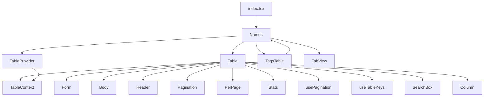
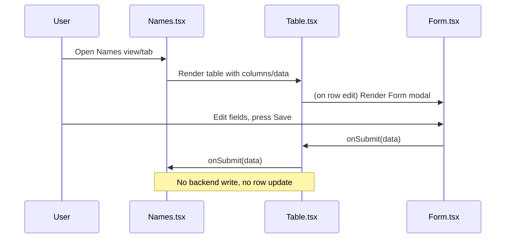

# Names View Design (Table Integration, No Backend Write)

This document explains the structure, data flow, and current limitations of the Names view. The Names view is a consumer of the `Table` component (and, through it, the `Form` component), but does not persist edits to the backend or update the table row after editing.

---

## 1. File/Component Relationship

---

## 2. Data & Event Lifecycle: How Names Works

**Narrative:**

- The user can view, filter, and sort names in a table.
- The user can open a modal form to edit a row, but saving does not persist changes or update the table row.
- All data is loaded from the backend, but edits are not written back.

---

## 3. Table & Form Structure

- The `Table` component provides sorting, filtering, pagination, and row selection.
- The `Form` component is used for editing, but is currently read-only with respect to backend updates in this view.
- The `TagsTable` component allows tag selection and filtering, but does not persist tag changes.

---

## 4. Current Limitations

- **No Backend Write:** Edits made in the form modal are not sent to the backend.
- **No Row Update:** The table row is not updated after editing; changes are not reflected in the UI.
- **Future Work:** Implementing backend persistence and row updates will require additional logic.

---

## 5. Visual Layout

- The view supports a dual-table layout (tags and names) with responsive design.
- Keyboard shortcuts are supported for focusing and toggling the tags table.

---

## Summary

- The Names view is a rich, interactive table UI for managing names and tags.
- It leverages the `Table` and `Form` components for display and editing, but does not yet support saving edits.
- Future enhancements will focus on backend integration and real-time row updates.
